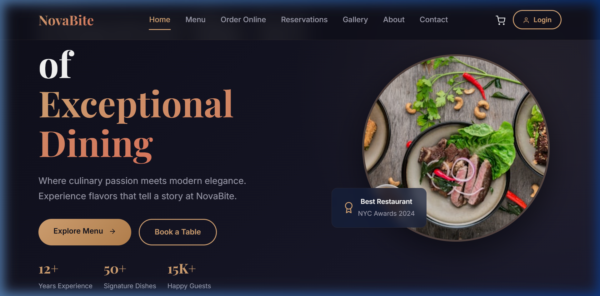
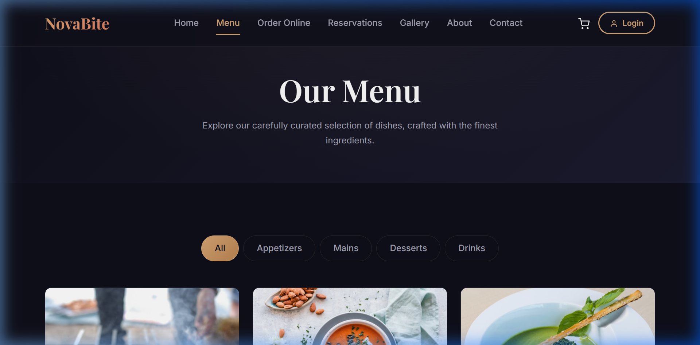
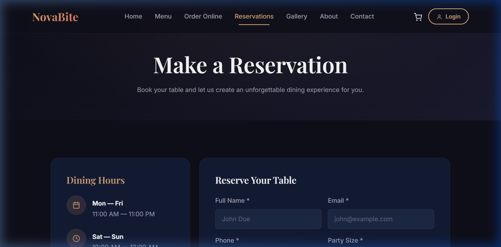

# 🍽️ NovaBite — Restaurant Web Application

A full-stack restaurant web application built with React.js, Node.js, Express, and MongoDB. NovaBite allows users to browse the menu, order food online, book tables, and manage their accounts.

## 📸 Screenshots

### Home Page


### Menu Page


### Reservations Page


## 🛠️ Technologies Used

| Layer | Technology |
|-------|-----------|
| Frontend | React.js (Vite), Bootstrap 5, React Router |
| Backend | Node.js, Express.js |
| Database | MongoDB, Mongoose |
| Authentication | JWT, bcrypt.js |

## 📄 Pages (9 Total)

| Page | Description |
|------|------------|
| Home | Landing page with featured dishes and testimonials |
| Menu | Full menu with category filters and add-to-cart |
| Order Online | Shopping cart with checkout form (login required) |
| Reservations | Table booking form with date and time selection |
| Contact | Contact form and Google Maps location |
| About | Restaurant story, stats, and team info |
| Gallery | Photo grid with lightbox viewer |
| Register | User registration with validation |
| Login | User authentication with JWT |

## 📝 Forms (6 Total)

All forms include both client-side and server-side validation:
- Reservation Form
- Contact Form
- Newsletter Signup
- Checkout / Order Form
- Registration Form
- Login Form

## 🚀 How to Run

### Prerequisites
- Node.js installed
- MongoDB installed and running locally

### 1. Clone the repository
```bash
git clone https://github.com/Omar-Elhadidi/NovaBite.git
cd NovaBite
```

### 2. Start the Backend
```bash
cd server
npm install
node seed.js        # Seeds menu items (run once)
node server.js      # Starts API on port 5000
```

### 3. Start the Frontend
Open a second terminal:
```bash
cd client
npm install
npm run dev         # Starts React app on port 5173
```

### 4. Open in Browser
Visit: **http://localhost:5173**

## 📁 Project Structure

```
NovaBite/
├── client/                 # React Frontend
│   └── src/
│       ├── components/     # Navbar, Footer
│       ├── pages/          # 9 page components
│       └── index.css       # Design system
├── server/                 # Node.js Backend
│   ├── config/             # Database connection
│   ├── middleware/          # JWT authentication
│   ├── models/             # 6 Mongoose schemas
│   ├── routes/             # 6 API route files
│   ├── seed.js             # Database seeder
│   └── server.js           # Express entry point
└── .gitignore
```

## 👥 Team

| Member | Pages |
|--------|-------|
| Student 1 | Home, Menu, Reservations |
| Student 2 | Contact, About, Gallery |
| Student 3 | Order Online, Register, Login |
